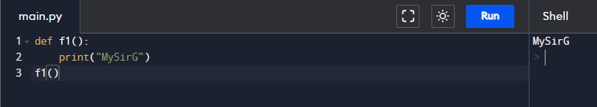
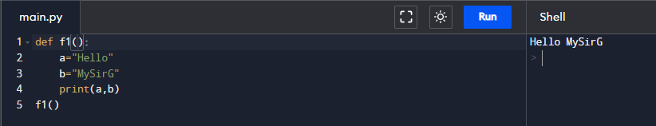
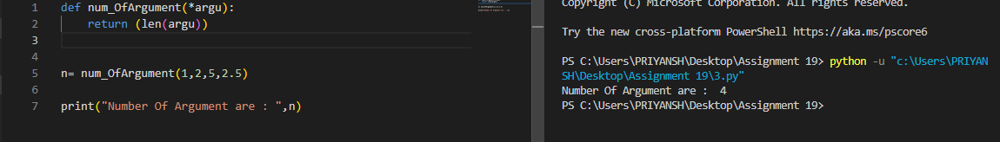
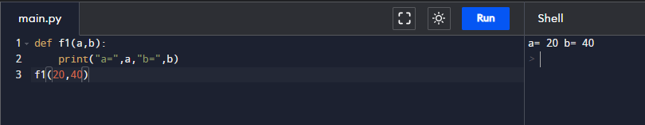
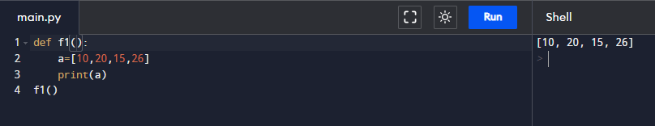
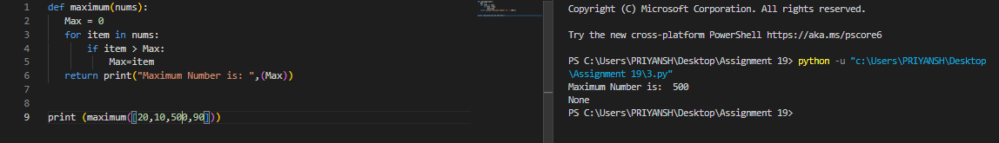
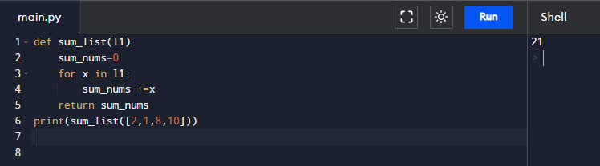
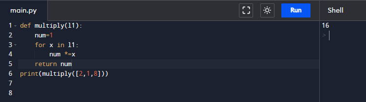
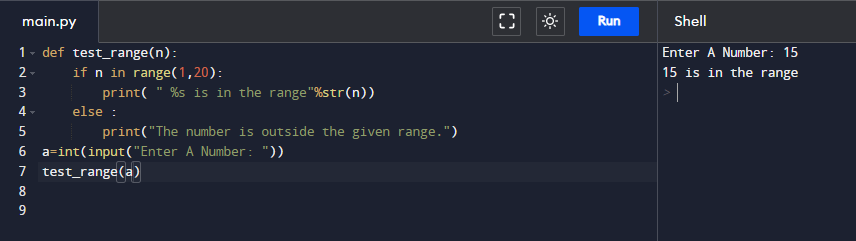
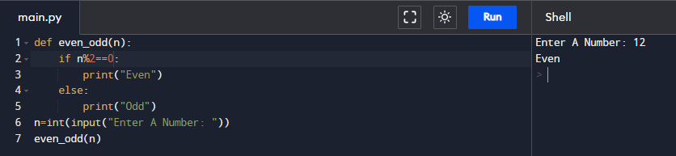

# Assignment - 19 Full Stack Web Development using Python MySirG Functions

    Qns 1. Write a python program to create a simple function which prints “MySirG” .

    Ans.

    Qns 2. Write a python program to create a function which expects two arguments and print them in the function body.

    Ans.

    Qns 3. Write a python program to create a function which expects an unknown number of arguments.

    Ans.

    Qns 4. Write a python program to create a function which expects kwargs arguments.

    Ans.

    Qns 5. Write a python program to create a function which expects a list as an argument.

    Ans.

    Qns 6. Write a python program to create a function that finds a maximum of four numbers.

    Ans.

    Qns 7. Write a python program to sum all the numbers in a list.

    Ans.

    Qns 8. Write a python program to multiply all the numbers in a list.

    Ans.

    Qns 9. Write a python program to create a function to check whether a number falls in a given range.

    Ans.

    Qns 10. Write a python program to create a function to check whether a given number is even or odd.

    Ans.
